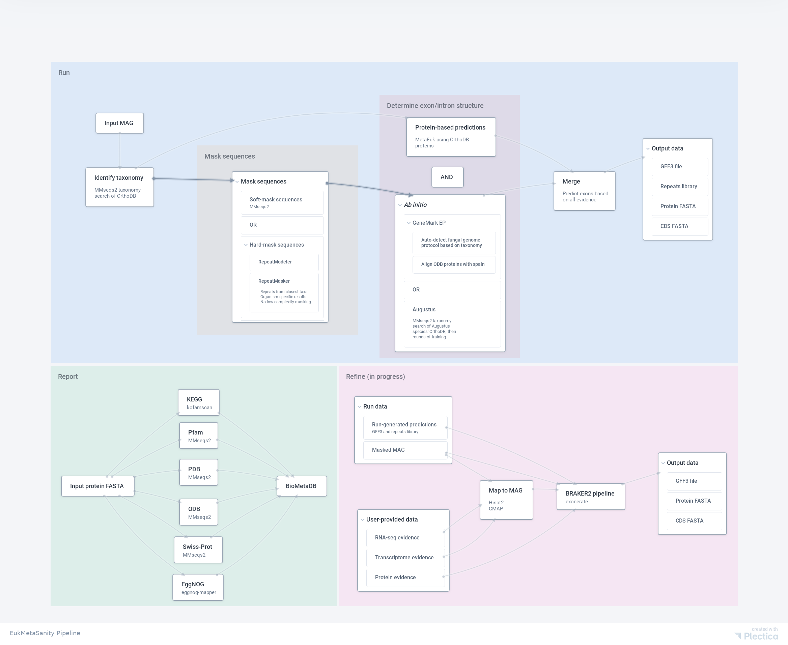

# EukMetaSanity

## About
Eukaryotic genome annotation is a laborious and time-intensive process. **EukMetaSanity** provides a structural and 
functional annotation of MAGs in a highly-parallel fashion, allowing for quick and in-depth analyses. The software is
customizable - users may choose from several provided options based on their analysis needs, and power users with Python
experience can easily extend the **EukMetaSanity** code base to add to or create new pipelines!

This software suite is broken up into several sub-programs



### Run
Identify putative taxonomy using the OrthoDB and MMseqs2 and annotate repeated regions of
the genome with either MMseqs2 or RepeatModeler/RepeatMasker. 

Generate *ab initio* structural predictions of coding regions of the genome using either Augustus or GeneMark.
Refine predictions with protein evidence using MetaEuk.

### Refine
Map RNA-seq (using HISAT2) and assembled transcriptome (using GMAP) evidence from closely related organisms (same 
organism or species) to the genome to add additional evidence using BRAKER2. 

### Report
Identify RNA (noncoding, tRNA, etc.) regions of the genome using Rfam.

Search KEGG, EggNOG, and any MMseqs2 database for functional annotation of putative proteins.

## Installation

See <a href="https://github.com/cjneely10/EukMetaSanity/blob/master/INSTALLATION.md" target="_blank">INSTALLATION.md</a> 
for detailed installation instructions.

## Usage

After running `download-data.py`, config files will be available in the database
directory. These can be edited to fit your needs. Make sure that all `DATA` and `PATH` sections reference valid
locations on your system.

If the `download-data.py` script was not used, then the default config files will be available in this repo's 
`config` directory.

```
usage: EukMetaSanity.py [-h] -f FASTA_DIRECTORY -c CONFIG_FILE [-x EXTENSIONS]
                        [-o OUTPUT] [-d]
                        command

Run EukMetaSanity pipeline

positional arguments:
  command               Select from run/report/refine/fast_refine

optional arguments:
  -h, --help            show this help message and exit
  -f FASTA_DIRECTORY, --fasta_directory FASTA_DIRECTORY
                        Directory of FASTA files to annotate, or paths_summary.tsv for report step
  -c CONFIG_FILE, --config_file CONFIG_FILE
                        Config file
  -x EXTENSIONS, --extensions EXTENSIONS
                        Gather files matching list of extensions separated by '/', default .fna/.fasta/.fa
  -o OUTPUT, --output OUTPUT
                        Output directory, default out
  -d, --debug           Developer mode: display all commands on single thread, default False
```

### Example usage

#### Run
Copy and edit the `run-config.ini` config file to fit your analysis needs.

Ensure your input FASTA sequences do not have the pipe (`|`) character present.

For a directory of MAGs:
```
MAGs/
  |-- mag1.fna
  |-- mag2.fna
```

Generate initial ab initio and protein-based annotation models using the command:

```
EukMetaSanity -f MAGs -c run-config.ini run
```

Add `-x <ext[,ext]>` if your extension does not match the default list, or if other files are present in the directory.

This will create a directory structure resembling:
```
out/
  |-- wdir/
  |-- run-eukmetasanity.log
  |-- results/
      |-- run-paths_summary.tsv
      |-- run/
          |-- mag1/
              |-- mag1.nr.gff3  # Final predictions
              |-- mag1.cds.fna  # CDS sequences
              |-- mag1.faa  # Protein sequences
              |-- metaeuk.gff3  # Protein-based prediction
              |-- mag1.gff3  # Ab initio based prediction
              |-- mag1.all.gff3  # Merged/redundant prediction
              |-- mag1.fna  # Original genome/MAG
              |-- mag1-mask.fna  # Masked genome/MAG in FASTA format
              |-- mask.final.gff3  # Masked genome/MAG in GFF3 format
              |-- mask.final.tbl  # Masking statistics
          |-- mag2/
              .. 
```

#### Refine (optional)
Copy and edit the `refine-config.ini` config file to fit your analysis needs. Pay close attention to the input format
for RNA-seq and transcriptomes that is required by the config file:

```
# Paths to RNA-seq should be contained in a file with the format (excluding spaces around tab):
# file-basename \t /path/to/r1.fq[,/path/to/r2.fq][;/path/to/r3.fq[,/path/to/r4.fq]]
# Transcriptomes should be contained in a file with the format (excluding spaces around tab):
# file-basename \t /path/to/tr1.fna[,/path/to/tr2.fna]
``` 

The listed paired-end or single-end reads will be mapped to the file that begins with `file-basename`, as will the list 
of transcriptomes.

Integrate RNAseq and transcriptomic evidence into annotation models using the command:

```
EukMetaSanity -f out/run-paths_summary.tsv -c refine-config.ini fast_refine
```

This will update the directory structure:
```
out/
  |-- wdir/
  |-- refine-eukmetasanity.log
  |-- run-eukmetasanity.log
  |-- results/
      |-- refine-paths_summary.tsv
      |-- run-paths_summary.tsv
      |-- refine/
          |-- mag1/
              ..
          |-- mag2/
              ..
      |-- run/
          |-- mag1/
              ..
          |-- mag2/
              .. 
          ..
```

#### Report (optional)
Copy and edit the `report-config.ini` config file to fit your analysis needs.

Annotate gene models using the command:

```
EukMetaSanity -f out/{}-paths_summary.tsv -c report-config.ini report
```

Replacing `{}` with either `run` or `refine` (if this step was completed).

This will update the directory structure:
```
out/
  |-- wdir/
  |-- report-eukmetasanity.log
  |-- refine-eukmetasanity.log
  |-- run-eukmetasanity.log
  |-- results/
      |-- report-paths_summary.tsv
      |-- refine-paths_summary.tsv
      |-- run-paths_summary.tsv
      |-- report/
          |-- mag1/
              |-- mag1.summary  # TSV-summary of all annotations
              |-- mag1.db  # SQLite3 summary of all annotations
              ... (results based on annotation programs run)
          |-- mag2/
              ..
      |-- refine/
          |-- mag1/
              ..
          |-- mag2/
              ..
      |-- run/
          |-- mag1/
              ..
          |-- mag2/
              .. 
          ..
```

## Citations

Neely, C. J., & Tully, B. *EukMetaSanity*. Source code is available at [https://github.com/cjneely10/EukMetaSanity](). 
It is implemented in Python 3 under the GNU General Public License v3.0.

Also cite all dependencies that you used, as **EukMetaSanity** would not be possible were it not for the developers of 
these programs.

https://bioinformaticsworkbook.org/dataAnalysis/GenomeAnnotation/Intro_to_Braker2.html#gsc.tab=0


